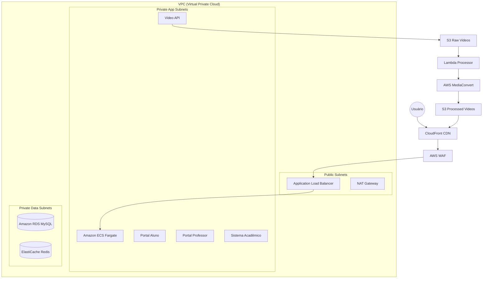

# UniPlus - Plataforma de Ensino Digital

## 📖 Sobre o Projeto
UniPlus é uma plataforma de ensino moderna e escalável, projetada para suportar alta demanda de alunos e professores, oferecendo aulas gravadas, materiais didáticos e gestão acadêmica.

## 🏗️ Arquitetura da Solução

A infraestrutura foi desenhada seguindo os pilares do **AWS Well-Architected Framework**: Excelência Operacional, Segurança, Confiabilidade, Eficiência de Performance e Otimização de Custos.



---

## 🚀 Serviços e Decisões de Arquitetura

### 1. Computação: Amazon ECS (Fargate)
**Decisão:** Utilizamos ECS Fargate em vez de EC2 ou Kubernetes (EKS).
- **Por que?** Remove a necessidade de gerenciar servidores (OS patching, scaling de cluster). Fargate permite focar apenas na definição da tarefa (container), ideal para times ágeis.
- **Microserviços:**
  - `portal-aluno`: Interface principal dos estudantes.
  - `portal-professor`: Interface de gestão de aulas e notas.
  - `sistema-academico`: Core do negócio (matrículas, histórico).
  - `video-api`: Upload e gestão de conteúdo.

### 2. Banco de Dados: Amazon RDS (MySQL)
**Decisão:** MySQL gerenciado via RDS.
- **Por que?** Compatibilidade com legado, robustez e facilidade de gestão. O RDS automatiza backups, updates e (em prod) failover Multi-AZ.

### 3. Armazenamento e CDN: S3 + CloudFront
**Decisão:** Arquitetura de vídeo sob demanda (VOD) serverless.
- **S3:** Armazenamento ilimitado e barato para vídeos brutos e processados.
- **CloudFront:** Entrega conteúdo com baixa latência globalmente, reduzindo carga nos servidores e custo de data transfer (cache na borda).

### 4. Processamento de Vídeo: Lambda + MediaConvert
**Decisão:** Pipeline assíncrono orientado a eventos.
- **Fluxo:** Upload -> S3 -> SQS -> Lambda -> MediaConvert.
- **Por que?** Desacopla o processamento pesado (transcodificação) da API principal. O usuário não fica esperando o vídeo converter.

### 5. Infraestrutura como Código (IaC): Terraform
**Decisão:** Todo o ambiente é versionado com Terraform.
- **Módulos:** Redes, Compute, Database, Storage, CDN configurados de forma reutilizável.
- **Benefício:** Ambientes de Dev e Prod idênticos na arquitetura, mudando apenas a escala.

### 6. Monitoramento: CloudWatch
**Decisão:** Observabilidade nativa centralizada.
- **Dashboards:** Métricas de negócio (latência, erros 5xx) e infra (CPU, RAM).
- **Logs:** Centralizados no CloudWatch Logs para fácil debug.

---

## ⚙️ Estratégia de Autoscaling

A plataforma utiliza uma estratégia híbrida de escalabilidade para lidar com a sazonalidade do setor educacional:

1.  **Escalonamento Reativo (Target Tracking):**
    - Aumenta tasks se CPU > 70% ou Memória > 80%.
    - Garante resposta a picos inesperados.

2.  **Escalonamento Agendado (Scheduled Scaling):**
    - **Pré-prova:** Aumenta capacidade 30 min antes dos horários de pico (07:00 e 18:00).
    - **Matrículas:** Capacidade triplicada durante semanas de matrícula (Jan/Jul).
    - **Economia Noturna:** Reduz ao mínimo (1 task) na madrugada.

---

## 🛠️ Como Executar (Local & Deploy)

### Pré-requisitos
- Docker & Docker Compose
- Terraform >= 1.5
- AWS CLI configurado

### Rodando Localmente
```bash
docker-compose up -d --build
# Acessar em http://localhost:80
```

### Deploy (Dev / Prod)
O deploy é automatizado via **GitHub Actions**:
1. Criação de infraestrutura (Terraform).
2. Build e Push de imagens Docker (ECR).
3. Atualização dos serviços ECS.

Para acionar manualmente:
1. Edite `.iupipes` (controle de pipeline).
2. Commit na branch `main` (prod) ou `develop` (dev).

---

## 🔜 Próximos Passos: Configuração de Domínio

Para configurar o seu domínio (ex: `uniplus.com.br`) adquirido no **Registro.br**, siga estes passos:

### 1. Limitação Importante (CNAME na Raiz)
O CloudFront utiliza um endereço do tipo `d1234.cloudfront.net`.
- **Problema:** O Registro.br (e a maioria dos DNS legados) **não permite** criar um registro `CNAME` para o domínio raiz (ex: `uniplus.com.br`), apenas para subdomínios (ex: `www.uniplus.com.br`).
- **Solução Recomendada:** Utilizar o **Amazon Route53** como DNS autoritativo.

### 2. Configuração Ideal (Com Route53)
1.  Crie uma **Hosted Zone** no Route53 para seu domínio.
2.  Copie os 4 servidores NS (Name Servers) gerados pelo Route53.
3.  No **Registro.br**, altere os servidores DNS do seu domínio para os 4 NS da AWS.
4.  No Route53, crie um registro do tipo `A` (Alias) apontando para o CloudFront.
    - Isso permite usar o domínio sem `www`.

### 3. Configuração Alternativa (Sem Route53 - Apenas Registro.br)
Se você não puder usar o Route53 agora, você **DEVE** usar um subdomínio (como `www` ou `app`).

1.  No **AWS Certificate Manager (ACM)**:
    - Solicite um certificado para `www.uniplus.com.br`.
    - Copie o CNAME de validação DNS.
2.  No **Registro.br (DNS)**:
    - Crie o registro CNAME de validação do ACM.
    - Aguarde o certificado ser emitido na AWS.
3.  No **CloudFront**:
    - Adicione `www.uniplus.com.br` em "Alternate Domain Names (CNAMEs)".
    - Selecione o certificado ACM criado.
4.  No **Registro.br (DNS)**:
    - Crie um novo registro:
        - **Entrada:** `www`
        - **Tipo:** `CNAME`
        - **Valor:** `d12345.cloudfront.net` (URL do seu CloudFront).

> **Nota:** Nesta configuração alternativa, o usuário **precisa** digitar `www` para acessar. O domínio raiz não funcionará.

---

## 🔒 Segurança

- **WAF:** Proteção contra SQL Injection e XSS.
- **Security Groups:** Princípio do privilégio mínimo (apenas ALB fala com ECS na porta da aplicação).
- **Private Subnets:** Bancos e aplicações não têm IP público. Acesso externo apenas via Load Balancer.
- **KMS / Secrets Manager:** Credenciais de banco encriptadas e rotacionadas.

---

**Equipe de Engenharia UniPlus**
