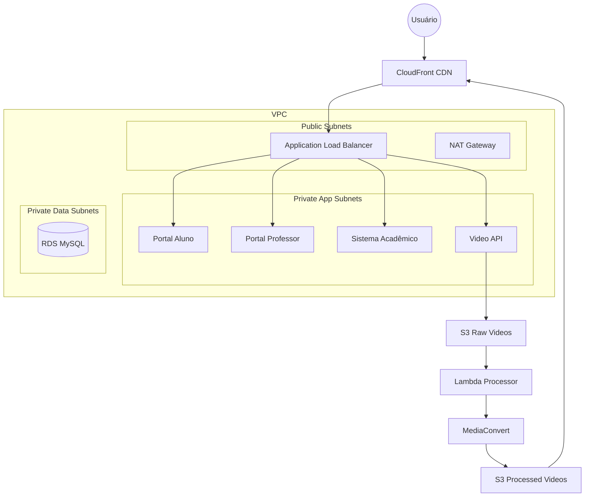

# UniPlus - Plataforma de Ensino Digital

## 📖 Sobre o Projeto
UniPlus é uma plataforma de ensino moderna e escalável, projetada para suportar alta demanda de alunos e professores, oferecendo aulas gravadas, materiais didáticos e gestão acadêmica.

---

## 🏗️ Arquitetura da Solução

A infraestrutura foi desenhada seguindo os pilares do **AWS Well-Architected Framework**: Excelência Operacional, Segurança, Confiabilidade, Eficiência de Performance e Otimização de Custos.

### Topologia de Rede

```
┌─────────────────────────────────────────────────────────────────────┐
│                              INTERNET                                │
└─────────────────────────────────────────────────────────────────────┘
                                   │
                                   ▼
                         ┌─────────────────┐
                         │   CloudFront    │  ← CDN Global (HTTPS)
                         │  (*.cloudfront) │
                         └────────┬────────┘
                                  │
                                  ▼
┌─────────────────────────────────────────────────────────────────────┐
│                              VPC                                     │
│  ┌───────────────────────────────────────────────────────────────┐  │
│  │                    PUBLIC SUBNETS                              │  │
│  │   ┌─────────────────────────────────────────────────────────┐ │  │
│  │   │  Application Load Balancer (ALB)                        │ │  │
│  │   │  - Recebe tráfego do CloudFront                         │ │  │
│  │   │  - Roteia por path (/aluno, /professor, /academico...)  │ │  │
│  │   └─────────────────────────────────────────────────────────┘ │  │
│  │   ┌─────────────────────────────────────────────────────────┐ │  │
│  │   │  NAT Gateway (saída para internet das tasks ECS)        │ │  │
│  │   └─────────────────────────────────────────────────────────┘ │  │
│  └───────────────────────────────────────────────────────────────┘  │
│                                  │                                   │
│                                  ▼                                   │
│  ┌───────────────────────────────────────────────────────────────┐  │
│  │                   PRIVATE APP SUBNETS                          │  │
│  │   ┌─────────────┐ ┌─────────────┐ ┌─────────────┐             │  │
│  │   │ ECS Task    │ │ ECS Task    │ │ ECS Task    │ ...         │  │
│  │   │ portal-aluno│ │ portal-prof │ │ sistema-acad│             │  │
│  │   └─────────────┘ └─────────────┘ └─────────────┘             │  │
│  │   ⚠️ SEM IP PÚBLICO - Acesso via ALB apenas                   │  │
│  └───────────────────────────────────────────────────────────────┘  │
│                                  │                                   │
│                                  ▼                                   │
│  ┌───────────────────────────────────────────────────────────────┐  │
│  │                   PRIVATE DATA SUBNETS                         │  │
│  │   ┌─────────────────────────────────────────────────────────┐ │  │
│  │   │  RDS MySQL (Banco de Dados)                             │ │  │
│  │   └─────────────────────────────────────────────────────────┘ │  │
│  └───────────────────────────────────────────────────────────────┘  │
└─────────────────────────────────────────────────────────────────────┘
```

### Diagrama de Fluxo (Mermaid)



---

## � Segurança de Rede

| Componente | Localização | Acesso Público |
|------------|-------------|----------------|
| **ECS Tasks** | Private Subnets | ❌ Não |
| **RDS MySQL** | Private Data Subnets | ❌ Não |
| **ALB** | Public Subnets | ✅ Sim (via CloudFront) |
| **NAT Gateway** | Public Subnets | ✅ Saída apenas |

### Fluxo de Tráfego Permitido

| Origem | Destino | Permitido |
|--------|---------|-----------|
| Internet → ECS | Direto | ❌ Bloqueado |
| Internet → ALB | CloudFront | ✅ Permitido |
| ALB → ECS | Security Group | ✅ Permitido |
| ECS → RDS | Security Group | ✅ Permitido |
| ECS → Internet | NAT Gateway | ✅ Permitido |

---

## ❓ Por que NÃO usamos API Gateway?

| Funcionalidade | API Gateway | ALB + CloudFront |
|----------------|-------------|------------------|
| Roteamento por path | ✅ | ✅ |
| HTTPS/TLS | ✅ | ✅ |
| Cache de respostas | ✅ | ✅ |
| WebSockets | ✅ | ✅ |
| Rate Limiting nativo | ✅ | ⚠️ Via WAF |
| Autenticação JWT nativa | ✅ | ❌ No código |
| **Custo por milhão de req** | ~$3.50 | **~$0.008** |

**Conclusão:** Para containers ECS, o ALB + CloudFront é mais econômico e suficiente. API Gateway seria necessário apenas para autenticação OAuth centralizada ou migração para Lambda.

---

## 🚀 Serviços e Decisões de Arquitetura

### 1. Computação: Amazon ECS (Fargate)
- **Por que?** Remove a necessidade de gerenciar servidores. Fargate permite focar apenas no container.
- **Microserviços:**
  - `portal-aluno`: Interface dos estudantes.
  - `portal-professor`: Gestão de aulas e notas.
  - `sistema-academico`: Matrículas e histórico.
  - `video-api`: Upload de vídeos.

### 2. Banco de Dados: Amazon RDS (MySQL)
- **Por que?** Gestão automatizada de backups, updates e failover Multi-AZ (em produção).

### 3. CDN: CloudFront + S3
- **S3:** Armazenamento de vídeos.
- **CloudFront:** Entrega global com baixa latência e HTTPS gratuito.

### 4. Processamento de Vídeo: Lambda + MediaConvert
- **Fluxo:** Upload → S3 → SQS → Lambda → MediaConvert.
- **Por que?** Processamento assíncrono, não bloqueia o usuário.

---

## ⚙️ Como Funciona o Autoscaling com ALB

Quando o ECS escala (cria nova Task), o processo é **automático**:

```
1. ECS detecta alta de CPU/Memória
         ▼
2. Nova Task é criada
         ▼
3. ECS registra automaticamente no Target Group do ALB
         ▼
4. ALB faz Health Check (GET /health)
         ▼
5. Após 2-3 checks OK (~30s), Task recebe tráfego
```

**Não há risco** de a nova Task não receber tráfego. O registro é automático.

---

## 🛠️ Como Executar

### Localmente
```bash
docker-compose up -d --build
# Acessar em http://localhost:80
```

### Deploy (GitHub Actions)
1. Commit na branch `main` (prod) ou `develop` (dev).
2. Pipeline executa: Terraform → Build Docker → Push ECR → Update ECS.

---

## 💰 Estimativa de Custos - Ambiente DEV

### Recursos e Custos Mensais

| Serviço | Configuração | Custo/Mês (USD) |
|---------|--------------|-----------------|
| **NAT Gateway** | 1 unidade (720h) | $32.40 |
| **ECS Fargate** | 4 tasks (0.25 vCPU, 512MB cada) | $29.20 |
| **ALB** | 1 unidade | $16.20 |
| **RDS MySQL** | db.t3.micro, 20GB, sem backup | $12.41 |
| **CloudFront** | PriceClass_100, ~50 GB | $4.25 |
| **CloudWatch** | Logs + Dashboard | $3.00 |
| **S3** | 3 buckets (~5 GB) | $0.12 |
| **ECR** | 4 repositórios (~2 GB) | $0.20 |
| **Secrets Manager** | 1 secret | $0.40 |
| **Lambda/SQS** | Baixo uso | ~$0.00 |

### Resumo

| Categoria | Custo |
|-----------|-------|
| Networking (NAT) | $32.85 |
| Compute (ECS + ALB) | $45.40 |
| Database (RDS) | $12.41 |
| CDN + Storage | $4.57 |
| Monitoring | $3.40 |
| **TOTAL** | **~$98/mês** |

### 💡 Dicas de Otimização

| Ação | Economia Potencial |
|------|-------------------|
| Desligar DEV à noite/fim de semana | ~40% (~$40/mês) |
| Usar VPC Endpoints (remove NAT) | ~$32/mês |
| RDS Free Tier (primeiro ano) | ~$12/mês |
| ECS Fargate Spot | ~30% em ECS |

> **Nota:** Custos baseados em preços da região `sa-east-1` (São Paulo) em Fev/2026.

---

## 🔜 Próximos Passos: Configuração de Domínio

### Opção 1: Route53 (Recomendada)
- Mudar DNS do Registro.br para AWS.
- Criar Alias `A` record apontando para CloudFront.
- Permite usar domínio raiz (`uniplus.com.br`).

### Opção 2: Somente Registro.br
- Usar subdomínio obrigatoriamente (`www.uniplus.com.br`).
- Criar CNAME `www` → `dXXXX.cloudfront.net`.
- Criar certificado no ACM (us-east-1) e validar via DNS.

> **Nota:** CloudFront já oferece HTTPS gratuito para `*.cloudfront.net`. Certificado ACM só é necessário para domínio próprio.

---

**Equipe de Engenharia UniPlus**

