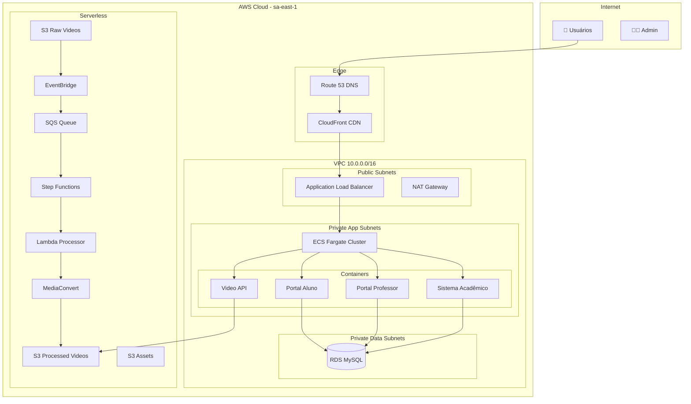
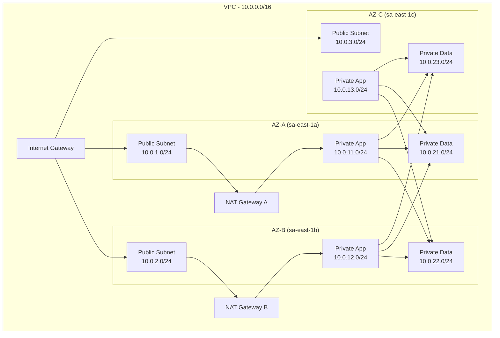
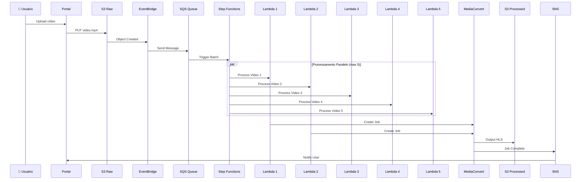
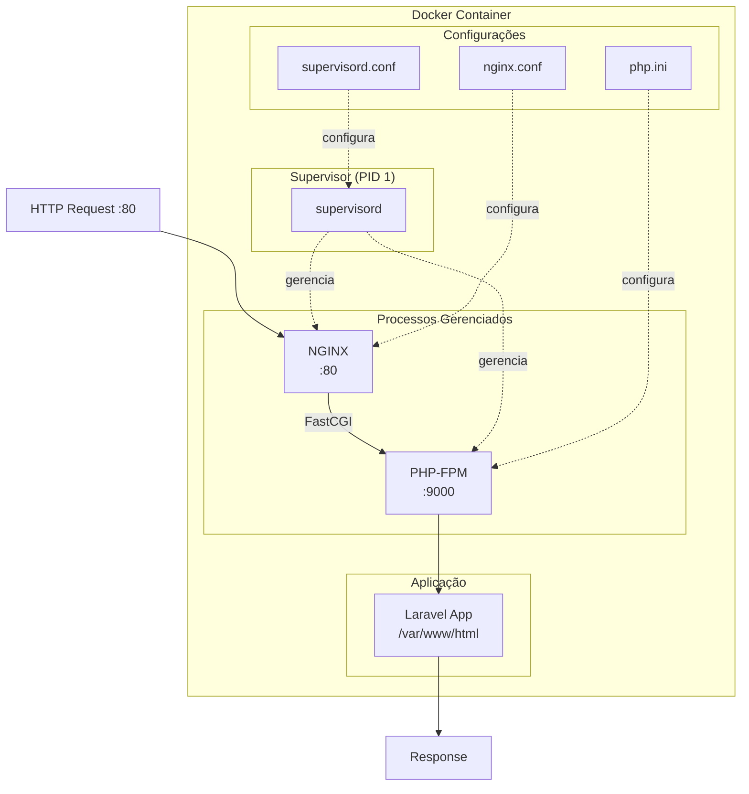
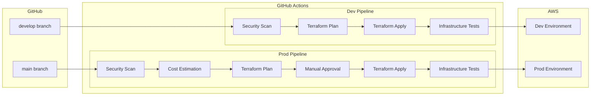
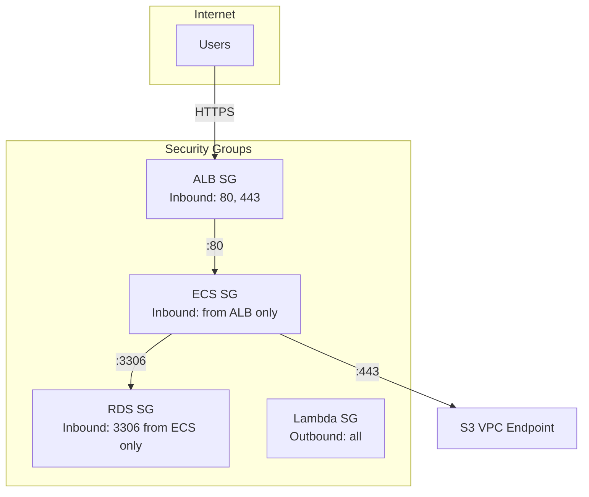
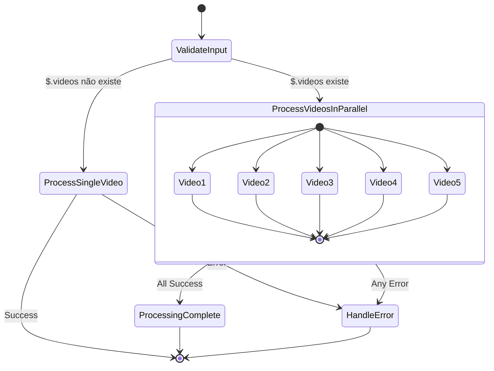

# UniPlus - Arquitetura da Plataforma

## Visão Geral

---

## Arquitetura de Rede (VPC)

---

## Pipeline de Processamento de Vídeo

---

## Arquitetura do Container PHP

### Arquivos de Configuração

| Arquivo | Responsabilidade |
|---------|------------------|
| `Dockerfile` | Receita para construir a imagem |
| `nginx.conf` | Configuração do web server (proxy, static files) |
| `php.ini` | Configuração do PHP (memory, upload, opcache) |
| `supervisord.conf` | Gerenciador de processos (nginx + php-fpm) |

---

## Fluxo de CI/CD

---

## Security Groups

---

## Step Functions - State Machine

---

## Custos Estimados

| Recurso | Dev (mensal) | Prod (mensal) |
|---------|-------------|---------------|
| ECS Fargate | ~$30 | ~$150 |
| RDS MySQL | ~$15 | ~$200 |
| ALB | ~$20 | ~$50 |
| S3 + CloudFront | ~$5 | ~$50 |
| NAT Gateway | ~$35 | ~$100 |
| Lambda + Step Functions | ~$1 | ~$10 |
| **Total** | **~$106** | **~$560** |

---

## Tecnologias Utilizadas

| Camada | Tecnologia |
|--------|------------|
| **IaC** | Terraform 1.10+ |
| **CI/CD** | GitHub Actions |
| **Container** | Docker + ECS Fargate |
| **Database** | MySQL 8.0 (RDS) |
| **CDN** | CloudFront |
| **Video** | MediaConvert + HLS |
| **Orquestração** | Step Functions |
| **Monitoramento** | CloudWatch |
| **Segurança** | Checkov, TFLint, Trivy |
